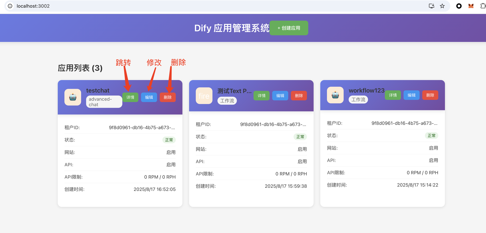

# Dify 机器人管理系统

访问http://localhost:3002
展示了dify系统的全部app，支持编辑、删除和跳转查看详情

TODO: 对接dify每个app关联workflow的graph dsl、运行log等等

## 效果图



## 技术栈

- **React 18** - 前端框架
- **TypeScript** - 类型安全
- **Axios** - HTTP 请求库
- **CSS3** - 样式设计

## 项目结构

```
src/
├── components/          # 组件目录
│   ├── BotList.tsx     # 机器人列表组件
│   ├── BotList.css     # 列表样式
│   ├── BotForm.tsx     # 机器人表单组件
│   └── BotForm.css     # 表单样式
├── services/           # 服务层
│   └── api.ts         # API 服务
├── types/             # 类型定义
│   └── dify.ts        # Dify 相关类型
├── data/              # 数据层
│   └── mockData.ts    # Mock 数据
├── App.tsx            # 主应用组件
├── App.css            # 主应用样式
└── index.tsx          # 应用入口
```

## 快速开始

### 安装依赖

```bash
npm install
```
